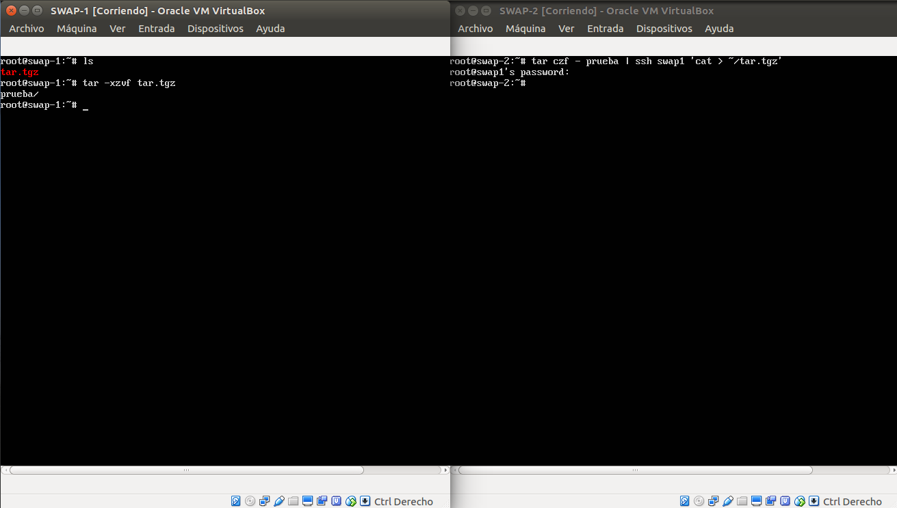
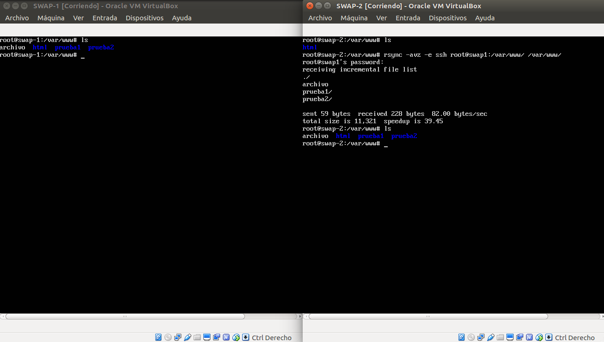
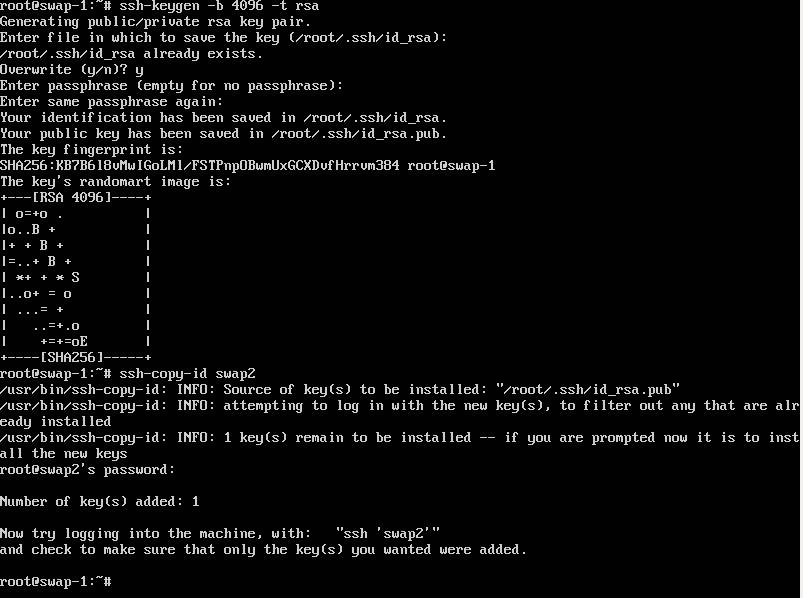
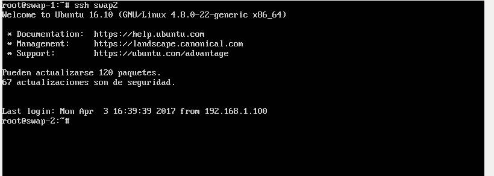
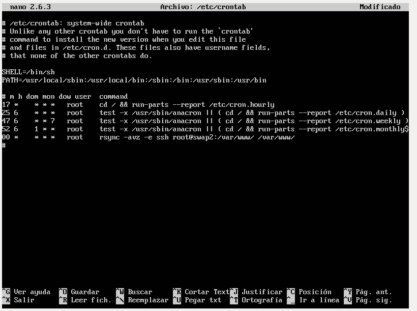
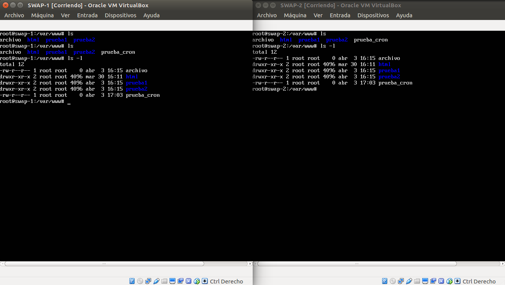

# Práctica 2

**Preparación de las máquinas virtuales**

Para facilitar la tarea de gestión entre las maquinas virtuales hemos nombrado estas en el archivo */etc/hosts*.

Con esto evitaremos dirigirnos a las máquinas por su IP.

Además hemos ejecutado *passwd root*, lo cual nos permite acceder al 
usuario root.

**Transmisión de archivos mediante tar**

Un primer paso para acercarnos a la transmisión de datos entre equipos es con el comando tar, sin embargo, este no nos servirá para sincronizar grandes cantidades de datos.

**Copia de archivos por ssh y clonado de carpetas**

Para la transmisión de archivos entre equipos usaremos el software rsync.

Una vez instalado debemos revisar el archivo /etc/sshd_config y cambiar la siguiente linea:

*PermitRootLogin yes*

Con esto podremos acceder al usuario root de forma remota con ssh.

Tras esto reiniciamos el servicio con:

*service ssh restart*

Una vez hecho no habrá ningun problema para la clonación de carpetas entre equipos:

**SSH sin contraseña**

Debemos establecer una conexión sin contraseña ya que la intención final es conseguir una sincronización automática entre equipos, algo que es imposible si el administrador debe insertar la contraseña manualmente cada vez que se desee clonar una carpeta.

Para conseguir esta conexión no hemos usado los comandos establecidos en el guión (salvo *ssh-copy-id swap2*) sino aquellos brindados por la página: *https://manuth.life/configuring-ssh-public-key-authentication-ubuntu-server-16-04/* (página de ayuda enviada por el grupo de clase).

Ejecutamos los comandos:

Tras esto, conseguimos el resultado esperado:

**Crontab**

Para finalizar, establecemos la sincronización de la carpeta /var/www/ entre los equipos (con swap2 como equipo principal).

