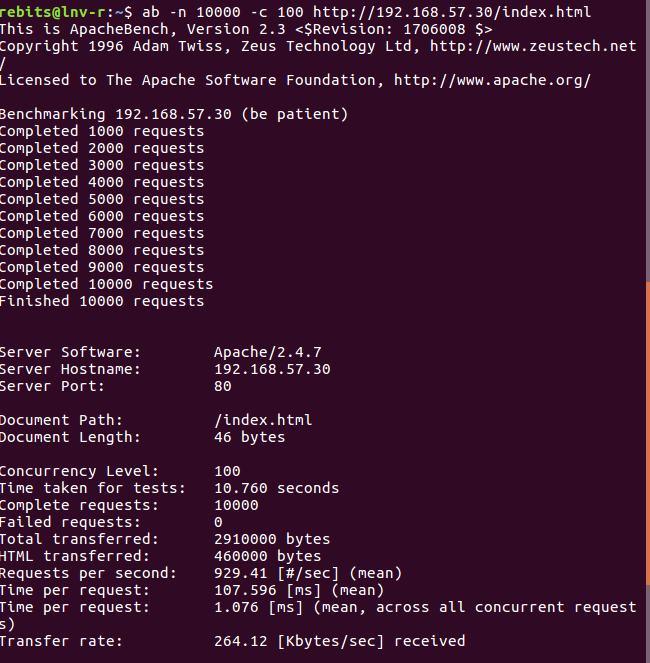
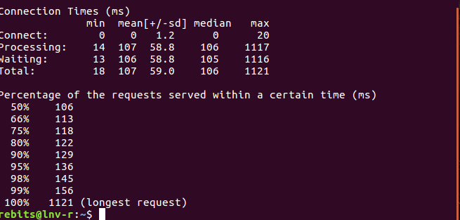

# Práctica 3

**Configurar una máquina e instalarle el nginx como balanceador de carga**

Primero instalamos nginx:

A continuación modificamos el archivo de configuración */etc/nginx/conf.d/default.conf*:

Reiniciamos el servicio nginx :

Comprobamos su funcionamiento:

Seguidamente modificamos de nuevo el archivo  */etc/nginx/conf.d/default.conf* para añadir los pesos de las máquinas:

Comprobamos su funcionamiento:

**Configurar una máquina e instalarle el haproxy como balanceador de carga**

Primero instalamos haproxy:

A continuación modificamos el archivo de configuración */etc/haproxy/haproxy.cfg*:

Iniciamos el servicio (parando cualquiera aplicación que ocupe el puerto 80, en nuestro caso nginx) :

Comprobamos su funcionamiento:

Seguidamente modificamos de nuevo el archivo  */etc/nginx/conf.d/default.conf* para añadir los pesos de las máquinas:

Comprobamos su funcionamiento:

**Someter a la granja web a una alta carga, teniendo primero nginx y después haproxy**

Sometemos a la granja web a una alta carga:

*Nginx*

)

*Haproxy*

