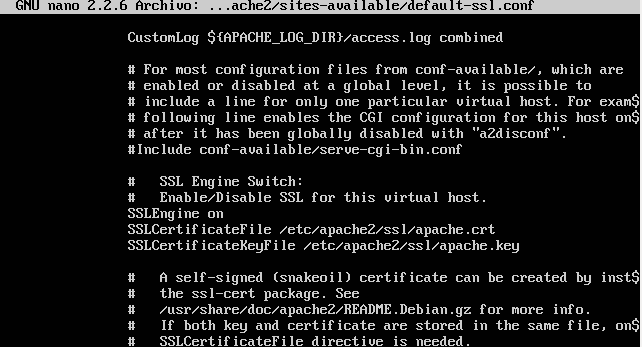

# Práctica 3

**Configuración de https**

Primero ejecutamos *sudo a2enmod ssl* obteniendo: 

Tras esto debemos crear una la carpeta */etc/apache2/ssl* y ejecutar lo siguiente

A continuación modificamos el archivo */etc/apache2/sites-avaible/default-ssl.conf* añadiendo SSLCertificateFile y SSLCertificateKeyFile

Actiavamos el sitio default-ssl y recargamos apache2 para que se hagan efectivos los cambios realizados:

Tras esto, podemos observar que al acceder al servidor desde la máquina anfitrion obtenemos lo siguiente:

El aviso se debe a que hemos usado un certificado autofirmado pero añadiendo una excepción podemos acceder a nuestra página web demostrando el correcto funcionamiento del servidor

**IPTABLES**

Ahora nos centraremos en la configuración del las talbas ip.

Para una correcta configuración de las tablas ip en nuestro servidor web ejecutamos el siguiente script

Observamos los resultados con *iptables -L -n -v*

