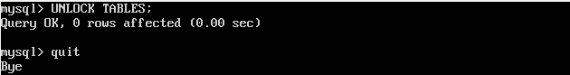
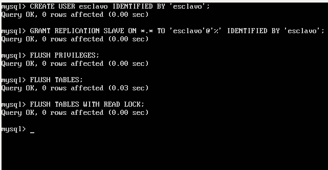

# Práctica 5

**Crear una BD con al menos una tabla y algunos datos.**

Para la creación de una base de datos debemos seguir los siguientes pasos:

1.- Iniciamos mysql como root
2.- Creamos una nueva base de datos con:

 *create database nombre_de_base_de_datos;*
 
3.-Creamos una nueva tabla
4.-Insertamos nuevos valores a la tabla creada

Todo esto se puede ver en las siguientes capturas:

Para la realización de la práctica emplearemos la base de datos de prueba de mysql llamada world.

Para usar esta base de datos debemos de importarla mediante:

**Realizar la copia de seguridad de la BD completa usando mysqldump.**

Realizamos una copia de seguridad de la BD completa mediante el comando:

*mysql world -u root -p > /root/world.sql*

Pero debido a que los datos pueden estar actualizandose constantemente en el servidor principal debemos evitar que se acceda a la base de datos

Para ello ejecutamos en mysql:

Una vez ejecutado mysqldump debemos desbloquear las tablas:

Con esto ya tenemos creada la copia de seguridad.

**Restaurar dicha copia en la segunda máquina (clonado manual de la BD).**

Restaurar una copia de seguridad en mysql es bastante sencillo. Para ello necesitamos tener configurado correctamente un servidor ssh y ejecutar el siguiente comando

Ya hemos obtenido el archivo de la copia de seguridad ahora necesitamos importar la base de datos, para ello primero accedemos a mysql y creamos una base de datos vacia con el mismo nombre que la base de datos a importar, en nuestro caso world

Una vez hecho importamos la base de datos sobre la base de datos del mismo nombre :

**Realizar la configuración maestro-esclavo de los servidores MySQL para que la
replicación de datos se realice automáticamente.**

Para una correcta configuración maestro-esclavo de los servidores mysql debemos seguir los siguientes pasos:

1.-Modificamos el archivo /etc/mysql/my.cnf como administrador. Comentando la linea *bind-address 127.0.0.1*
y descomentando *server-id = 1*

2.-Reiniciamos el servicio

3.-Modificamos el archivo /etc/mysql/my.cnf como administrador, pero esta vez en la máquina esclavo. La modificación será idéntica al paso 1 pero en lugar de *server-id =1* será *server-id=2*

4.- Reiniciamos el servicio

5.- Creamos un usuario esclavo en la máquina maestro:

6.-Observamos los datos de la base de datos que vamos a replicar:

7.- Establecemos la máquina master en la máquina esclava (hemos usado los datos obtenidos en el paso anterior):

8.- Arrancamos la máquina esclavo en la máquina maestro con *START SLAVE*

9.- Desbloqueamos las tablas en la máquina maestro con *UNLOCK TABLES;*

10.- Nos aseguramos que todo este correctamente configurado ejecutando el comando *SHOW SLAVE STATUS\G*

Como podemos ver la variable *Seconds_Behind_Master* es distinta de null por lo que todo esta correctamente configurado.

Una vez terminados todos los pasos veamos que efectivamente funciona:

En la máquina master agregamos un nuevo país con nombre Pais_Prueba

Ahora accedemos a la base de datos desde la máquina esclava y busquemos dicho país

Como podemos observar en la captur todo funciona correctamente.
