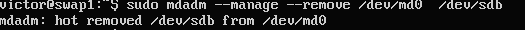

# Práctica 6

**Realizar la configuración de dos discos en RAID 1 bajo Ubuntu, automatizando el montaje del dispositivo creado al inicio del sistema.**

En primer lugar debemos añadir a nuestra máquina virtual dos discos de 2GB.

Para ello:

1.- Nos dirigimos a configuración de almacenamiento de nuestra máquina y creamos un nuevo disco virtual SATA

2.- Seleccionamos VDI

3.- Con tamaño fijo de 2GB

4.- Observamos que tenemos los discos creados

A continuación debemos instalar *mdadm*

Ahora vemos la informacion con *sudo fdisk -l*

A continuación creamos el RAID1 usando el dispositivo /dev/md0:

*sudo mdadm -C /dev/md0 --level=raid1 --raid-devices=2 /dev/sdb /dev/sdc*

Ahora usaremos mkfs /dev/md0 para darle formato.

Seguidamente creamos la carpeta para montar la unidad RAID y montamos el dispositivo sobre ella

Comprobamos con *sudo mount* si el proceso se ha realizado adecuadamente.

Comprobamos el estado del RAID ejecutando

*sudo mdadm --detail /dev/md0*

Para finalizar el proceso de configuración del RAID debemos configurar el sistema para que al arrancar el equipo, este monte  el dispositivo RAID. 

Para esto debemos ejecutar primero *ls -l /dev/disk/by/uuid* para obtener su UUID

Finalmente editamos el archivo /etc/fstab/ con la información obtenida anteriormente

**Simular un fallo en uno de los discos del RAID (mediante comandos con el mdadm), retirarlo “en caliente”, comprobar que se puede acceder a la información que hay almacenada en el RAID, y por último, añadirlo al conjunto y comprobar que se reconstruye correctamente.**

Simulamos un fallo ejecutando: *sudo mdadm --manage --set-faulty /dev/md0 /dev/sdb*

Con el comando *mdadm --detail /dev/md0* observamos si lo hemos realizado correctamente

A continuación lo retiramos en caliente:

Comprobamos su estado

Por último lo añadimos al conjunto nuevamente

Comprobamos el estado final

